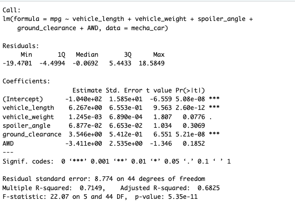
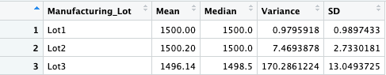

# MechaCar_Statistical_Analysis

## Overview

The purpose of this analysis is to aid AutosRU's production troubles by providing production data insights. The data analytics that were performed are the following:
- A multiple linear regression to identify what variables predict the mpg of MechaCar prototypes
- Summary statistics on the pounds per square inch (PSI) of suspension coils from manufacturing lots
- T-tests to determine if manufacturing lots are statistically different from the mean population
- A statistical study to compare vehicle performance of the MechaCar vehicles against vehicles from other manufacturers

## Results

## Multiple Linear Regression Model to Predict MPG

The following image shows a multiple linear regression and the effects of the following variables on mpg:
- Vehicle length
- Vehicle weight
- Spoiler angle
- Drivetrain
- Ground clearance

From this output we can make the following three conclusions:
1. Given a significance level of 5%(p=0.05), vehicle length and ground clearance provide a non-random amount of variance to mpg values. In other words, these two variables have a statistically significant influence on mpg of the MechaCar prototypes. The other variables, in turn, do not have a significant effect on mpg. 
2. Keeping the same level of significance, the p-value of 5.35e-11 would indicate that there is evidence to reject the null hypothesis. Therefore, the slope of the linear model is not zero.
3. The model has an r-squared value of 0.7149. This means that 71% of all predictions will be determined by the model. 

## Summary Statistics on Suspension Coils

- Summary statistics of PSI for all manufacturing lots

- Summary statistics of PSI for each manufacturing lot

For the design specifications for the MechaCar suspension coils, the variance cannot exceed 100 PSI. Without looking at each lot individually, the variance from the total summary data frame is about 62.3 PSI. However, when we look at the second data frame, lot 3 exceeds the limit with a variance of about 170.3 PSI. 